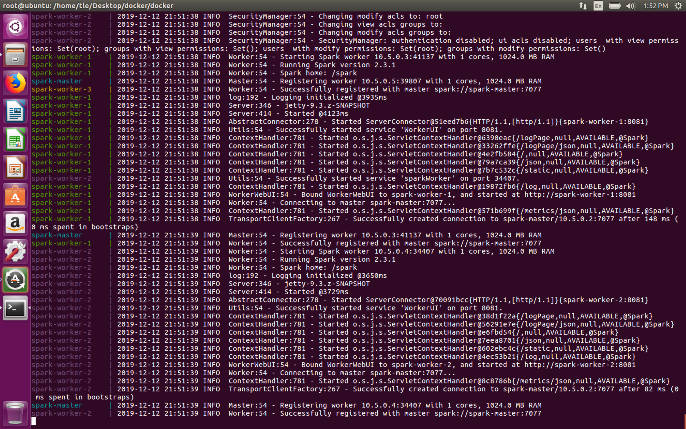

# HADOOP PROJECT - RAPPORT

## Introduction

Pour ce projet, nous avons choisi d'utiliser docker pour automatiser l'installation d'un cluster spark avec Hadoop.
Nous allons nous interessé aux différentes images (Dockerfile) utilisées pour notre cluster ainsi qu'au fichier "docker-compose.yml" utilisé pour définir le cluster.

## Qu'est ce que docker?

Docker ou conteneur est une unité logicielle standardisée.
Un conteneur est une unité logicielle standard qui regroupe le code et toutes ses dépendances afin que l'application s'exécute rapidement et de manière fiable d'un environnement informatique à un autre. Une image de conteneur Docker est un package logiciel exécutable autonome et léger qui comprend tout le nécessaire pour exécuter une application: code, runtime, outils système, bibliothèques système et paramètres.
Les conteneurs et les machines virtuelles présentent des avantages d'isolation et d'allocation des ressources similaires, mais fonctionnent différemment car les conteneurs virtualisent le système d'exploitation au lieu du matériel. Les conteneurs sont plus portables et efficaces.


### Conteneurs

Les conteneurs sont une abstraction au niveau de la couche d'application qui conditionne le code et les dépendances ensemble. Plusieurs conteneurs peuvent s'exécuter sur la même machine et partager le noyau du système d'exploitation avec d'autres conteneurs, chacun s'exécutant en tant que processus isolés dans l'espace utilisateur. Les conteneurs occupent moins d'espace que les machines virtuelles (les images de conteneurs font généralement des dizaines de Mo), peuvent gérer plus d'applications et nécessitent moins de machines virtuelles et de systèmes d'exploitation.

### Machines virtuelles

Les machines virtuelles (VM) sont une abstraction du matériel physique transformant un serveur en plusieurs serveurs. L'hyperviseur permet à plusieurs machines virtuelles de s'exécuter sur une seule machine. Chaque machine virtuelle comprend une copie complète d'un système d'exploitation, de l'application, des fichiers binaires et des bibliothèques nécessaires - occupant des dizaines de Go. Les machines virtuelles peuvent également être lentes à démarrer.

## Dockerfiles

Nous avons utilisé plusieurs images docker pour notre cluster, une image appelée base qui sera ensuite utilisée par les autres images (le master et les workers)

### Base

```Dockerfile
FROM java:8-jdk-alpine

ENV DAEMON_RUN=true
ENV SPARK_VERSION=2.3.1
ENV HADOOP_VERSION=2.7
ENV SCALA_VERSION=2.12.4
ENV SCALA_HOME=/usr/share/scala

RUN apk add --no-cache --virtual=.build-dependencies wget ca-certificates && \
    apk add --no-cache bash curl jq && \
    cd "/tmp" && \
    wget --no-verbose "https://downloads.typesafe.com/scala/${SCALA_VERSION}/scala-${SCALA_VERSION}.tgz" && \
    tar xzf "scala-${SCALA_VERSION}.tgz" && \
    mkdir "${SCALA_HOME}" && \
    rm "/tmp/scala-${SCALA_VERSION}/bin/"*.bat && \
    mv "/tmp/scala-${SCALA_VERSION}/bin" "/tmp/scala-${SCALA_VERSION}/lib" "${SCALA_HOME}" && \
    ln -s "${SCALA_HOME}/bin/"* "/usr/bin/" && \
    apk del .build-dependencies && \
    rm -rf "/tmp/"*
    
#Scala installation
RUN export PATH="/usr/local/sbt/bin:$PATH" && apk update && apk add ca-certificates wget tar && mkdir -p "/usr/local/sbt" && wget -qO - --no-check-certificate "https://piccolo.link/sbt-0.13.16.tgz" | tar xz -C /usr/local/sbt --strip-components=1 && sbt sbtVersion

RUN apk add --no-cache python3

RUN wget --no-verbose https://archive.apache.org/dist/spark/spark-${SPARK_VERSION}/spark-${SPARK_VERSION}-bin-hadoop${HADOOP_VERSION}.tgz && tar -xvzf spark-${SPARK_VERSION}-bin-hadoop${HADOOP_VERSION}.tgz \
      && mv spark-${SPARK_VERSION}-bin-hadoop${HADOOP_VERSION} spark \
      && rm spark-${SPARK_VERSION}-bin-hadoop${HADOOP_VERSION}.tgz
```

Nous sommes partis d'une image disponible en ligne, cette image contient linux alpine avec java 8 installé.

Nous avons rajouté plusieurs variable afin de pouvoir géré au mieux la version de spark, hadoop et scala que nous souhaitons installées.

Nous lançons plusieurs commandes pour installer scala, python, spark et hadoop.

### Master

Le Dockerfile:

```Dockerfile
FROM spark-base:2.3.1

COPY start-master.sh /

ENV SPARK_MASTER_PORT 7077
ENV SPARK_MASTER_WEBUI_PORT 8080
ENV SPARK_MASTER_LOG /spark/logs

EXPOSE 8080 7077 6066

CMD ["/bin/bash", "/start-master.sh"]
```

Le fichier start-master.sh:

```sh
#!/bin/bash

export SPARK_MASTER_HOST=`hostname`

. "/spark/sbin/spark-config.sh"

. "/spark/bin/load-spark-env.sh"

mkdir -p $SPARK_MASTER_LOG

export SPARK_HOME=/spark

ln -sf /dev/stdout $SPARK_MASTER_LOG/spark-master.out

cd /spark/bin && /spark/sbin/../bin/spark-class org.apache.spark.deploy.master.Master --ip $SPARK_MASTER_HOST --port $SPARK_MASTER_PORT --webui-port $SPARK_MASTER_WEBUI_PORT >> $SPARK_MASTER_LOG/spark-master.out
```

Cette fois, nous partons directement de notre image précédente. (Le nom spark-base:2.3.1 sera donné pendant le build, nous reviendrons là dessus plus tard).

Cette image est utilisée pour créer un conteneur spark master. Nous utilisons des variables pour configurer le master.

Nous copions sur le conteneur un fichier .sh qui sera utilisé pour démarrer le master.

### Worker

Le Dockerfile:

```Dockerfile
FROM spark-base:2.3.1

COPY start-worker.sh /

ENV SPARK_WORKER_WEBUI_PORT 8081
ENV SPARK_WORKER_LOG /spark/logs
ENV SPARK_MASTER "spark://spark-master:7077"

EXPOSE 8081

CMD ["/bin/bash", "/start-worker.sh"]
```

Le fichier start-worker.sh:

```sh
#!/bin/bash

. "/spark/sbin/spark-config.sh"
. "/spark/bin/load-spark-env.sh"

mkdir -p $SPARK_WORKER_LOG

export SPARK_HOME=/spark

ln -sf /dev/stdout $SPARK_WORKER_LOG/spark-worker.out

/spark/sbin/../bin/spark-class org.apache.spark.deploy.worker.Worker --webui-port $SPARK_WORKER_WEBUI_PORT $SPARK_MASTER >> $SPARK_WORKER_LOG/spark-worker.out
```

Comme pour le master, nous partons directement de notre image base. Il suffit simplement comme pour le master de configurer le conteneur, copier un ficher .sh qui servira à lancer le worker.

### Spark-submit

Le Dockerfile:

```Dockerfile
FROM spark-base:2.3.1

COPY start-worker.sh /

ENV SPARK_WORKER_WEBUI_PORT 8081
ENV SPARK_WORKER_LOG /spark/logs
ENV SPARK_MASTER "spark://spark-master:7077"

EXPOSE 8081

CMD ["/bin/bash", "/start-worker.sh"]
```

Le fichier start-worker.sh:

```sh
#!/bin/bash

. "/spark/sbin/spark-config.sh"
. "/spark/bin/load-spark-env.sh"

mkdir -p $SPARK_WORKER_LOG

export SPARK_HOME=/spark

ln -sf /dev/stdout $SPARK_WORKER_LOG/spark-worker.out

/spark/sbin/../bin/spark-class org.apache.spark.deploy.worker.Worker --webui-port $SPARK_WORKER_WEBUI_PORT $SPARK_MASTER >> $SPARK_WORKER_LOG/spark-worker.out
```

On refait les mêmes étapes que précédemment. Ce conteneur spark-submit servira à lancer des jobs Spark.

## Build des images

Pour faciliter la construction des images, nous utilisons un fichier bash qui lancera tous les builds nécessaires. Nous utilisons l'option "-t" pour donner un nom à nos images.

```sh
#!/bin/bash

set -e

docker build -t spark-base:2.3.1 ./docker/base
docker build -t spark-master:2.3.1 ./docker/spark-master
docker build -t spark-worker:2.3.1 ./docker/spark-worker
docker build -t spark-submit:2.3.1 ./docker/spark-submit
```

## Docker Compose

Il ne reste plus qu'à préparer un fichier compose pour définir les différents services (conteneurs) de notre cluster. Il contient 4 services, 1 master et 3 workers.

Le fichier est le suivant:

```yml
 version: "3.7"
services:
  spark-master:
    image: spark-master:2.3.1
    container_name: spark-master
    hostname: spark-master
    ports:
      - "8080:8080"
      - "7077:7077"
    networks: 
      spark-network:
        ipv4_address: 10.5.0.2
    volumes:
       - /mnt/spark-apps:/opt/spark-apps
       - /mnt/spark-data:/opt/spark-data
    environment:
      - "SPARK_LOCAL_IP=spark-master"
  spark-worker-1:
    image: spark-worker:2.3.1
    container_name: spark-worker-1
    hostname: spark-worker-1
    depends_on:
      - spark-master
    ports:
      - "8081:8081"
    env_file: ./env/spark-worker.sh
    environment:
      - "SPARK_LOCAL_IP=spark-worker-1"
    networks: 
      spark-network:
        ipv4_address: 10.5.0.3
    volumes:
       - /mnt/spark-apps:/opt/spark-apps
       - /mnt/spark-data:/opt/spark-data
  spark-worker-2:
    image: spark-worker:2.3.1
    container_name: spark-worker-2
    hostname: spark-worker-2
    depends_on:
      - spark-master
    ports:
      - "8082:8081"
    env_file: ./env/spark-worker.sh
    environment:
      - "SPARK_LOCAL_IP=spark-worker-2"
    networks: 
      spark-network:
        ipv4_address: 10.5.0.4
    volumes:
       - /mnt/spark-apps:/opt/spark-apps
       - /mnt/spark-data:/opt/spark-data
  spark-worker-3:
    image: spark-worker:2.3.1
    container_name: spark-worker-3
    hostname: spark-worker-3
    depends_on:
      - spark-master
    ports:
      - "8083:8081"
    env_file: ./env/spark-worker.sh
    environment:
      - "SPARK_LOCAL_IP=spark-worker-3"
    networks: 
      spark-network:
        ipv4_address: 10.5.0.5
    volumes:
       - /mnt/spark-apps:/opt/spark-apps
       - /mnt/spark-data:/opt/spark-data
networks:
  spark-network:
    driver: bridge
    ipam:
     driver: default
     config:
       - subnet: 10.5.0.0/16
```

Nous définissons les images utilisées pour chaque conteneur ainsi que divers paramètres. Parmi les plus importants, on peut voir que chaque conteneur a 2 volumes de monter:

* /mnt/spark-apps:/opt/spark-apps: utilisé pour mettre le code et la configuration à la disposition de chaque worker/master.
* /mnt/spark-data:/opt/spark-data: utilisé pour mettre des fichiers d'entré/sorti à la disposition de chaque worker/master.

Ces deux supports vont permettre de simuler un système de fichier distribué (distributed file system) avec des support docker.

On gère également l'adressage de façon statique.

## Démarrage du cluster

Après que les images est été compilées,

```sh
sudo ./build-images.sh
```

il nous reste plus qu'à exécuter la commande suivante pour demarrer notre cluster:

```sh
docker-compose up
```

Ainsi notre cluster est démarré:



Nous pouvons maintenant accéder au master sur l'adresse http://10.5.0.2:8080


Enfin, nous pouvons accéder aux différents workers aux adresses suivantes :

* http://10.5.0.3:8081
* http://10.5.0.4:8081
* http://10.5.0.5:8081


